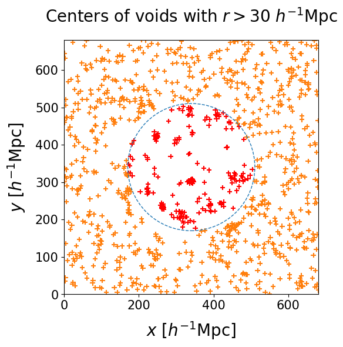

<!--

-->

 

<!-- 
# Table of content test

- [ **Data** ](#data)
    - [**Manticore**](#manticore)
    - [**Void finding**](#void-finding)
- [**Catalog**](#catalog)
    - [**Posterior distributions**](#posterior-distributions)
    - [**Full morphology: Voronoi clouds**](#full-morphology-voronoi-clouds)
    - [**Truncation**](#truncation)
- [**Validation**](#validation)

-->

# The Manticore dataset

To characterize the voids in our Local Neighborhood, we use the <tt>Manticore-Local</tt> posterior realizations of the large-scale structure, a set of constrained N-body simulations initialized to be consistent with the galaxy positions identified in the 2M++ data compilation ([Lavaux & Hudson, 2011](https://academic.oup.com/mnras/article/416/4/2840/975884){:target="_blank"}).
Produced in the Bayesian framework of the <tt>BORG</tt> algorithm ([Jasche & Wandelt 2013](https://academic.oup.com/mnras/article/432/2/894/1020272){:target="_blank"}), they represent 50 independent samples of the posterior distribution of the large-scale structure and allow us to carry out a complete statistical analysis of the voids. 
A full description of the simulations can be found in [McAlpine et al. (2025)](https://academic.oup.com/mnras/article/540/1/716/8128029?login=false){:target="_blank"}, and in the dedicated [Manticore website](https://cosmictwin.org){:target="_blank"}.

On the left we show the galaxy positions used for the inference, and on the right the corresponding set of 50 independent posterior realizations of halo distributions at present day. Stable structure can be recognized inside the dashed circle, corresponding to a $\approx 250 \, \text{Mpc}$ radius, i.e. the region where we observe galaxies. As there is no information to constrain the large-scale structure in the exterior part of the box, the density field is randomly distributed.

| {: style="height:480px" .align-left} | 🠊  |   {: style="height:550px" .align-right}

 

# Void finding procedure

We run the <tt>VIDE</tt> void finding algorithm ([Sutter et al. 2015](https://www.sciencedirect.com/science/article/pii/S2213133714000493?via%3Dihub){:target="_blank"}) on each individual realization of the cosmic web. The resulting voids have complex morphologies, but tehy can be summarized with a center and an effective radius. In the left panel we select voids with $r > 30 \ h^{-1} \, \text{Mpc}$, the crosses represent their centers and the circles correspond to their effective volumes. Despite some variations among different realizations, some regions of space are more likely to be identified as voids than others. The right panel shows a slice of the 3D space containing all void centers from all realizations. The member points of very identifyable clusters correspond to different samples of the same real void in the Universe.

Identifying stable voids in the posterior realizations of the Universe reduces to a detection problem. We perform a posterior clustering analysis to identify high-signficance voids in the Universe. The details of the clustering strategy and the posterior distribution estimation are illustrated [here](Clustering.md){:target="_blank"}.

| {: style="height:100%" .align-left}  |  {: style="height:100%" .align-center}
 

 

# Bayesian catalog and posterior distributions

We produce a catalog of 113 high-significance cosmic voids in the neighboring Universe, up to a distance of $\approx 200 \, h^{-1} \, \text{Mpc}$. The Bayesian nature of our procedure provides us with probability distributions for the quantities of interest, allowing rigorous uncertainty quantification. The following figures represent the posterior distributions of void centers, and a selection of the posterior distributions of the void radii (the full plot can be found [here](RadiusPosterior.md){:target="_blank"}).

{: style="width:70%" .align-center}

{: style="width:100%" .align-center}

Our catalog features a rigorous uncertainty quantification: a table summarizing the main quantities of interest can be found in the [VoidGallery](VoidGallery.md){:target="_blank"} section of this website. In order to visualize voids, we can consider the mean posterior of both distributions, effectively approximating voids as spheres with well-defined centers and radii. The result is presented here, with the colorscale representing the redshift. 
The zone of avoidance of galaxy surveys corresponding to the galactic plane produces a visible region with fewer voids.

{: style="width:80%" .align-center}

 

# The actual shape of voids

The <tt>VIDE</tt> void finder performs a Voronoi tessellation on the tracers of the density field and merges the resulting cells with a watershed transform. As a result, void morphologies are very complex. In the following gif, we show the individual contributions to a single statistical void: samples from different realizations are represented through circles corresponding to the Voronoi cells making an individual void, with the black cross and circle represent the mean and effective radii. Finally, the yellow star and circle represent the mean posterior of the center and radius, as infered from our clustering procedure.

{: style="width:70%" .align-center}

To characterize the shape of the void, we grid the space around the void center, and count how often a particular point is contained in a Voronoi cell. We define the Voronoi overlap rate, a quantity ranging from zero to one after appropriate normalization, which describes the environment around the void center. Higher values correspond to the most underdense part of the void, while lower values define to the boundaries. The left panel shows this function - which we name Voronoi cloud - overimposed to the sphere of effective volume. However, the volume of this cloud exceeds the statistical one, as the further outskirts are labeled as void only in a few realizations. Appropritate truncations of this cloud can yield the mean posterior volume (center panel) or probe the deeper interior of the void (right panel).
Further details on the Voronoi clouds and how we perform the truncation can be found [here](VoronoiClouds.md){:target="_blank"}

| Full cloud | Volume conservation | Void interior
| :-: | :-: | :-:
| {: style="width:100%" .align-center} | {: style="width:100%" .align-center} | {: style="width:100%" .align-center}

Finally, we show a fully interactive plot of the Voronoi cloud of an example void, as well as the galaxies used in the inference. The spherical approximation loses information on the full shape of voids; conversely, the Voronoi cloud provides a well-defined template for underdense environments.

  <iframe id="exampleVoid"
    title="Single void morphology"
    src="../assets/html_files/void_7_Voronoi_cloud_N32_with_galaxies.html"
    width='1200'
    height='1000'
    frameborder='0'
    >
  </iframe>

 

# Do our voids match the underlying halo field?

We compare our voids to the average of the 50 posterior realizations of the underlying halo field.
In the left panel we marginalize the Voronoi cloud by summing its values over the $z$ direction. We plot the $0$ and $0.5$ contour levels of the renormalized marginal over a slab of the halo field with thickness equal to void radius. We find that the countours follow the density profiles. As this projection loses 3D information, on the right panel we show different slice in $z$, which highlight the relation between the void and its environment.

{: style="width:100%" .align-center}

