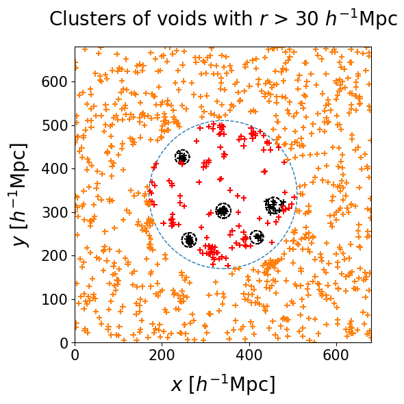

<br>

# Void clustering method

Detecting cosmic voids from posterior samples simplifies to a clustering problem. 
In order to separate differently sized voids that might happen to co-occur due to fluctuations between posterior realizations, we sort our voids into radius bins. The left panel shows the centers of voids with radius $r > 30 \, h^{-1} \, \text{Mpc}$. The right panel shows the clusters that our full procedure marks as significant. 


| {: style="height:100%" .align-left} |<span style="font-size: 50px"> 🠊 </span> | {: style="height:100%" .align-right}


We employ the [```AgglomerativeClustering```](https://scikit-learn.org/dev/modules/generated/sklearn.cluster.AgglomerativeClustering.html){:target="_blank"} algorithm implemented in ```scikit-learn``` package. At the first iteration every point belongs to its own cluster. Then clusters are progressively merged in order to minimize the variance, until a stopping criterion is reached. 
We choose the center of the radius bin as the threshold length, which enforces that the centers of voids should not be farther away from each other than their average radius. This will guarantee that voids in a cluster overlap spatially. An illustration of this clustering algorithm can be found [here](https://cdn-images-1.medium.com/v2/resize:fit:640/1*ET8kCcPpr893vNZFs8j4xg.gif){:target="_blank"}


## Spurious clusters

How many points make a cluster significant? Void centers that cannot be merged with many neighbors will make up clusters of just a few members. If not filtered out, they would be accepted as voids, despite carrying little to no statistical significance. The exterior and unconstrained region of the box allows us to assess the probability of having clusters of $n$ points by random chance. An acceptance threshold is needed to discard
these spurious clusters.

The figure below shows void centers in different radius bins:

| {: style="width:100%" .align-center}  |  {: style="width:100%" .align-center}  |  {: style="width:100%" .align-center}


* The right panel shows the biggest voids among all realizations, with $35 \, h^{-1} \, \text{Mpc} < r < 50 \, h^{-1} \, \text{Mpc}$. As these voids are very rare, random clusters are not very frequent and the acceptance threshold can be relatively low.
* The center panel shows middle sized voids, with $20 \, h^{-1} \, \text{Mpc} < r < 35 \, h^{-1} \, \text{Mpc}$. The distribution of radii peaks in this region, and clusters of many elements have a non-negligible probability of occurring by chance.
* The left panel shows the smallest voids, with $5 \, h^{-1} \, \text{Mpc} < r < 20 \, h^{-1} \, \text{Mpc}$. There are fewer voids than in the central panel, but the density of points is still high enough to make random clusters likely.

We run the same clustering algorithm on the outside box and count the occurrence of clusters of $n$ points. This correspond to a Poisson process quantifying the probability of having $n - 1$ excess points in the neighborhood of each void centers. The following panel shows the dependence with radius bin. For each bin we select an acceptance threshold $n_{th}$ such as the probability of having a cluster that numerous by pure chance is $6 \times 10^{-7}$, corresponding to the $5\sigma$ detection threshold.


{: .align-center}


## Continuous binning


In addition to the detection of regions in our Local Universe that represent true voids, we are interested in probing the underlying probability distribution of their properties. Unfortunately, the width of the bins used in the clustering algorithm is an arbitrary choice that affects the voids we actually compare, impacting the estimated variance of the radius probability distribution we would infer from them. Moreover, for a given choice of bin width, the position of the edges may split a significant cluster, where members of the same true void get grouped into two different clusters that do not pass the significance test individually.
In order to overcome these issues, we employ a continuous binning strategy, illustrated with the following toy model.

Let us consider a true void in the Universe: our goal is to infer the true underlying probability distribution of radius and position. We can draw samples from the probability distribution, which will create some scatter around the mean center. We assume a Gaussian for simplicity, but the distribution can have any shape.

{: .align-center}

As previously mentioned, posterior realizations have some statistical fluctuations, and the void finder can respond to that by generating different voids. This result in nuisance voids appearing by accident in the same region of space. We can represent them as smaller voids in he vicinity of the true void.

{: .align-center}

Then we fix the width of our radius bins, producing a window to shift continuously through the range of radii in our voids sample.
In such a way, there is always a bin choice that prevents the splitting of significant clusters.
With this strategy, voids with radii falling into the high density region of the underlying probability distribution belong to clusters that pass the acceptance criterion more often than others.
Conversely, voids sampled from the tails of the distribution are grouped into smaller clusters that will be labeled as spurious ones.


{: .align-center}

Counting how often each point is accepted assesses the importance of a single realization void in the evaluation of the statistical properties of the "true" void.
This procedure produces a list of independent voids from different halo field realizations, with their respective weights, represented as the red dots. We infer the underlying probability distribution with a weighted kernel density estimation (KDE). 


{: .align-center}


The shape of the inferred probability distribution presents some differences from the ground truth, but their means and standard deviations (represented with the error bars on the top) show a good match. Finally, the plot below shows that spurious points are overall avoided by this procedure; if they are close to the tails of the distribution they might still be included without distorting too much the inferred posterior.


{: .align-center}

