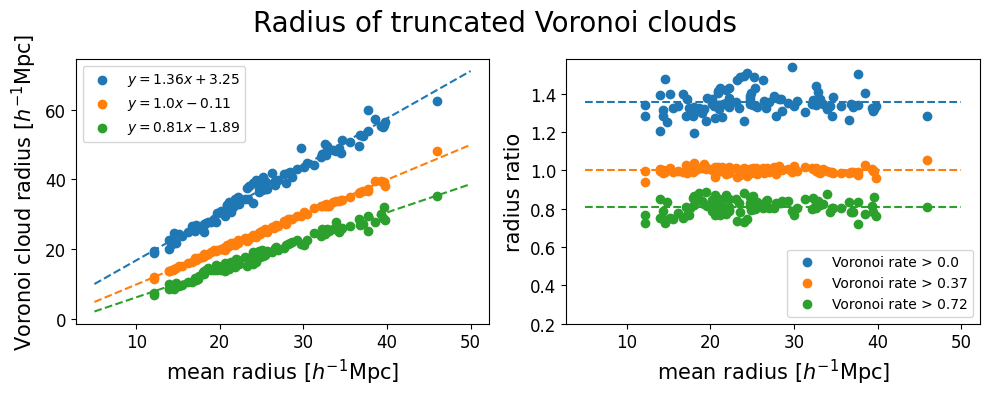

<br>

# Voronoi clouds


The ```VIDE``` void finder performs a Voronoi tessellation on the tracers of the density field and merges the resulting cells with a watershed transform. As a result, void morphologies are very complex. In the following gif, we show the individual contributions to a single statistical void: samples from different realizations are represented through circles corresponding to the Voronoi cells making an individual void, with the black cross and circle represent the mean and effective radii. Finally, the yellow star and circle represent the mean posterior of the center and radius, as inferred from our clustering procedure.

{: style="width:70%" .align-center}


### Full untruncated cloud


To characterize the shape of the void, we grid the space around the void center, and count how often a particular point is contained in a Voronoi cell. We define the Voronoi overlap rate, a quantity ranging from zero to one after appropriate normalization, which describes the environment around the void center. Higher values correspond to the most underdense part of the void, while lower values define to the boundaries. We show an interactive plot of this function - which we name Voronoi cloud - overimposed to the sphere of effective volume. 


<div>
  <iframe id="singleVoidUntruncated"
    title="Untruncated cloud"
    src="../assets/html_files/void_10_Voronoi_cloud_N32.html"
    width='1200'
    height='1000'
    frameborder='0'
    >
  </iframe>
</div>


### Truncated cloud

However, the volume of this cloud exceeds the statistical one, as the further outskirts are labeled as void only in a few realizations. Appropriate truncations of this cloud can yield the a volume that matches the mean posterior prediction, as shown below.


<div>
  <iframe id="singleVoidTruncated"
    title="Untruncated cloud"
    src="../assets/html_files/void_10_Voronoi_cloud_N32_pmin0.37.html"
    width='1200'
    height='1000'
    frameborder='0'
    >
  </iframe>
</div>


### How to choose the truncation level?


Different threshold of the Voronoi overlap rate $r_\text{Voro}$ will produce clouds of different sizes. We test three thresholds, corresponding to $r_\text{Voro} > 0.0; 0.37; 0.72$, and measure the resulting cloud volumes. We find that the relation with the mean statistical radius is overall linear. A threshold of $0.37$ preserves the mean posterior volume, while a deeper cut at $0.72$ probes the deeper interior of the void, at $\sim 80\%$ of the radius from the center.


{: style="width:100%" .align-center}


We can probe all truncation levels between 0 and 1, and measure the resulting ratio between the cloud ratio and the mean posterior. The relation between the cloud threshold and the size of the truncated Voronoi cloud provides an operational criterion to explore different density regions within the voids.


{: style="width:100%" .align-center}
